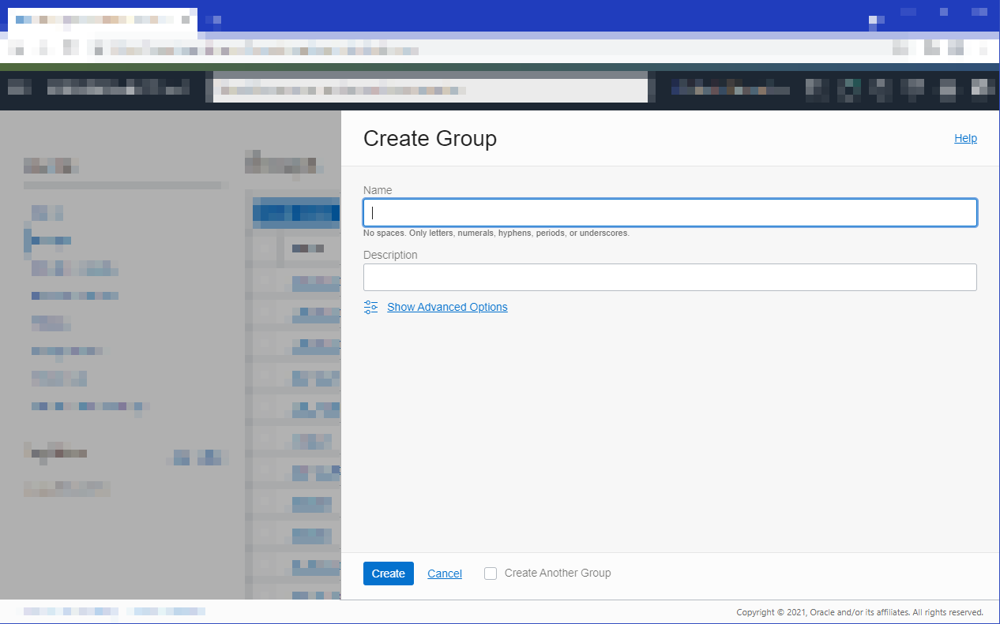
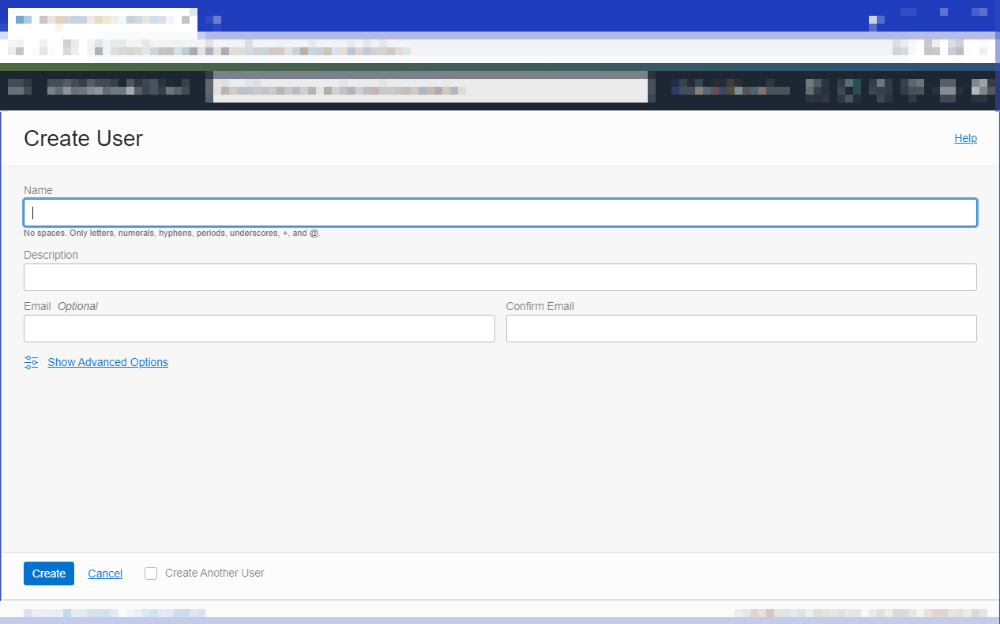
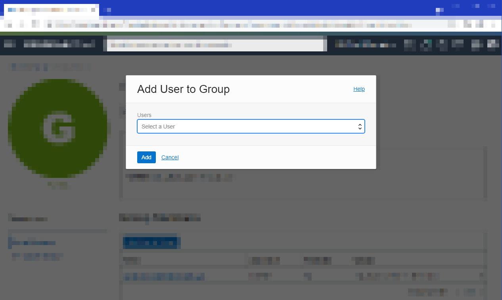
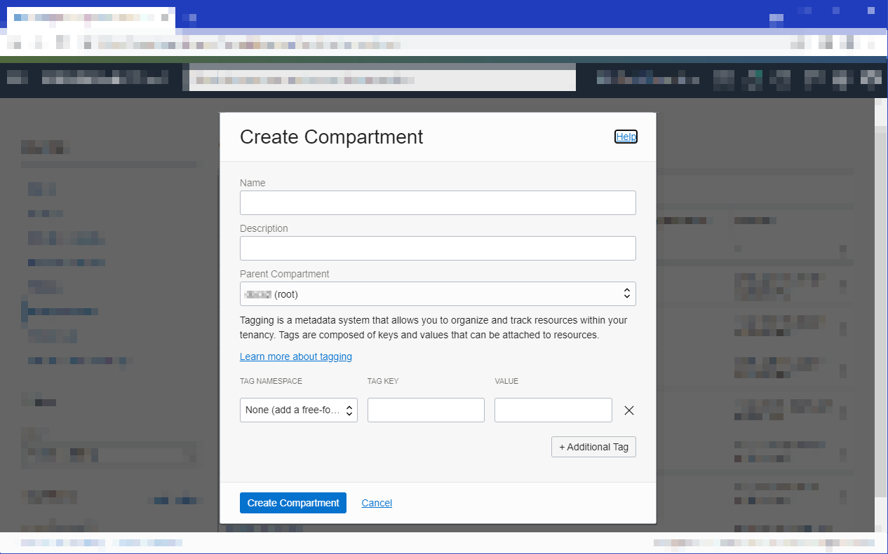
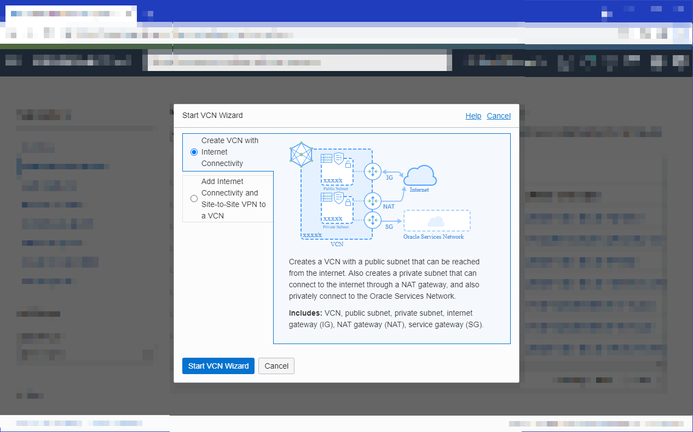
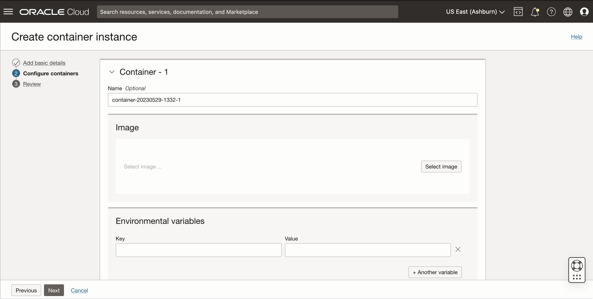
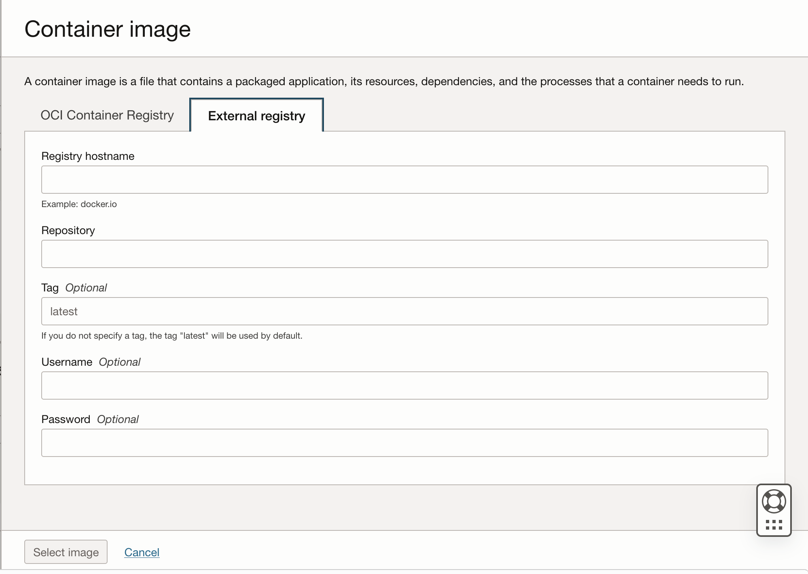
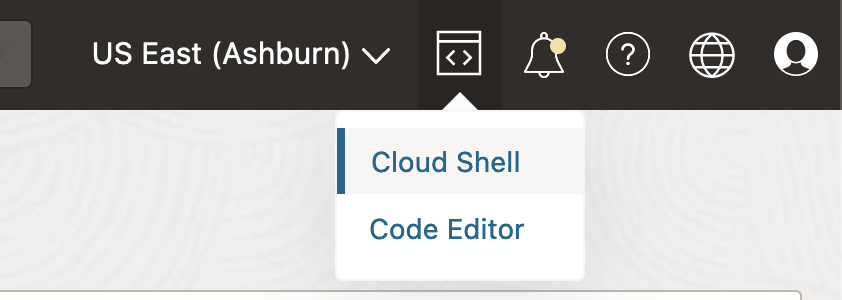

# Getting Started with Oracle Container Instances

### A. Set up your tenancy

If suitable users and groups don't exist already:
1. Sign into the Console as a tenancy administrator.
2. Open the navigation menu and click Identity & Security. Under Identity, click Groups.
3. Create a new group by clicking Groups and then Create Group.

4. Create a new user by clicking **Users** and then **Create User**.

5. Add a user to a group by clicking Groups, then the name of the group, and then Add User to Group.


For more information about creating groups and users, see:
* [To create a group](https://docs.oracle.com/en-us/iaas/Content/Identity/Tasks/managinggroups.htm#To)
* [To create a user](https://docs.oracle.com/en-us/iaas/Content/Identity/Tasks/managingusers.htm#create_user)
* [To add a user to a group](https://docs.oracle.com/en-us/iaas/Content/Identity/Tasks/managingusers.htm#add_user)

If a suitable compartment in which to create network resources and OCI Container Instances resources doesn't exist already:

1. Sign in to the Console as a tenancy administrator.
2. Open the navigation menu and click Identity & Security. Under Identity, click Compartments.
3. Click Create Compartment.


If a suitable VCN in which to create network resources doesn't exist already:

1. Sign in to the Console as a tenancy administrator.
2. Open the navigation menu, click Networking, and then click Virtual cloud networks.
3. Click Start VCN Wizard to create a new VCN.
4. In the Start VCN Wizard dialog box, select VCN with Internet Connectivity and click Start VCN Wizard.

6. Enter a name for the new VCN, click Next, and then click Create to create the VCN along with the related network resources.

Note that the networking configuration for your real application should be secure per your requirements.  These instructions are meant for demo purposes where you pull images from a public repo.

If one or more OCI Container Instance users is not a tenancy administrator:

1. Sign in to the Console as a tenancy administrator.
2. Open the navigation menu and click Identity & Security. Under Identity, click Policies.
3. Click Create Policy, specify a name and description for the new policy, and select the tenancy's root compartment.

The policy template includes the following policy statements:
```
Allow group <group-name> to manage compute-container-family in tenancy 
Allow group <group-name> to use virtual-network-family in tenancy 
Allow group <group-name> to read repos in tenancy
```
If necessary, you can restrict these policy statements by compartment.

See [Container Instance Policy Reference](https://docs.oracle.com/en-us/iaas/Content/container-instances/permissions/policy-reference.htm) for more information

### B. Create first Container Instance 

1. Sign in to the OCI Console as the new user created with permissions to use Container Instances.
2. In the Console, open the navigation menu and click Developer Services. Under Containers & Artifacts, click Container Instances.
3. Select the region you are using with OCI Functions.
4. Click Create container instance.
5. Fill out "Add basic details" page of "Create container instance" form.  
Please Specify:
* Correct compartment that corresponds with your policies
* Availability Domain you want instance to be launched with
* VCN and Subnet that maps to the public subnet you created in earlier steps. Note that a public subnet requires an internet gateway in the VCN, and a private subnet requires a service gateway in the VCN. 
Optionally Specify:
* Name of instance
* Shape, cpu, and memory configuration
* Any other parameters
6. Click Next.
7. Fill out "Configure containers" page of "Create container instance" form
For purposes of this demo, we will just utilize one container and image
* Under **Image** for first container, click **Select Image**

* In dialogue, click **External Registry** 
* In **Registry hostname**, put docker.io
* In **Repository**, put library/busybox

* Click **Select Image** at bottom of dialogue box
* Click **Next** at bottom of page
8. Review your settings on "Review" page.  Click "Create" at bottom of form
9. See Container Instance be created and wait for Container Instance to go to **Active** state

Congrats!  You have created your first Container Instance.

### C. Verify and Use Cloud Shell Integration

1. Log into OCI Console
2. In top right corner of the OCI Console, select **Developer tools** and **Cloud Shell**

3. In the Cloud Shell terminal, run the below command replacing <compartment-id> with your tenancy ocid or compartment ocid you launched Container Instance in.  The resulting list output should include the Container Instance you launched in the previous step.
```  
oci container-instances container-instance list --compartment-id <compartment-id>
```

Congratulations! You've just created your first Container Instance with OCI and were able to access instance via Cloud Shell and Container Instance API's!
