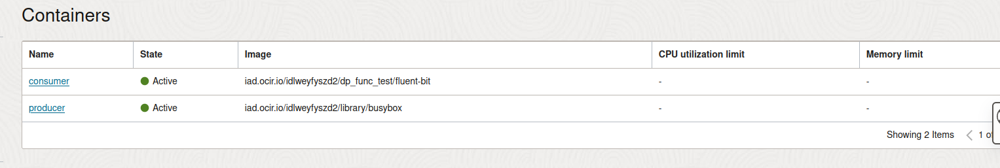
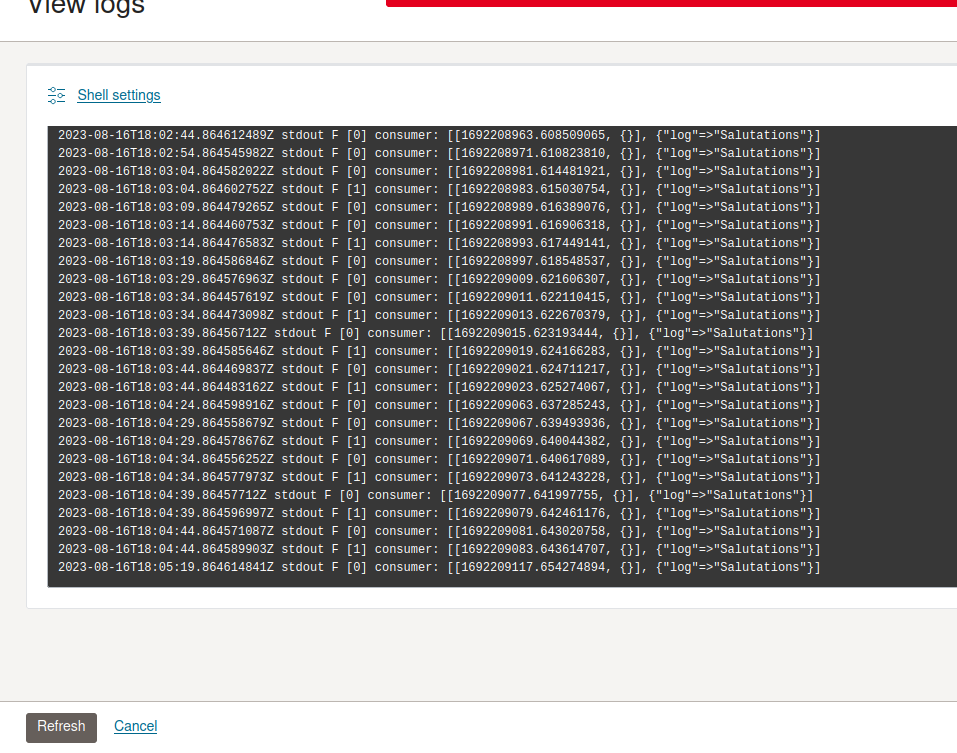

# Container Instance with a sidecar for logging

The purpose of this manifest is to show how to add a sidecar to container to collect logs and redirect them to the console.

# Requirement
* Able to create container instances via oci cli. https://docs.oracle.com/en-us/iaas/Content/API/SDKDocs/cliinstall.htm
* Able to create (public/private) images and push them to the container registry

# Steps
The following steps are intended to set up two containers "Producer" and "Consumer" that share an EmptyDir. The "Producer" generates logs into the emptyDir and the "Consumer" uses fluentd to collect the logs and redirect them to stdout.
### Step1: Create fluent-bit image and push it to the container registry
Dockerfile
```dockerfile
FROM fluent/fluent-bit:latest
COPY fluent-bit.conf /fluent-bit/etc/fluent-bit.conf
CMD ["/fluent-bit/bin/fluent-bit","-c","/fluent-bit/etc/fluent-bit.conf"]
```
Fluent-bit.config
```editorconfig
[SERVICE]
    # Flush
    # =====
    # Set an interval of seconds before to flush records to a destination
    Flush        5
 
    # Daemon
    # ======
    # Instruct Fluent Bit to run in foreground or background mode.
    Daemon       Off
 
    # Log_Level
    # =========
    # Set the verbosity level of the service, values can be:
    #
    # - error
    # - warning
    # - info
    # - debug
    # - trace
    #
    # By default 'info' is set, that means it includes 'error' and 'warning'.
    Log_Level    Off
 
    # Parsers_File
    # ============
    # Specify an optional 'Parsers' configuration file
    Parsers_File parsers.conf
    Plugins_File plugins.conf
 
 
[INPUT]  << Customerize your log location here
    Name tail
    Path /consumer/greetings
    Tag  consumer
 
[OUTPUT]
    Name  stdout
    Match *
```
If you want to push the image to ocir. Please refer to https://docs.oracle.com/en-us/iaas/Content/Registry/Tasks/registrypushingimagesusingthedockercli.htm

It is optional to push an image into a private repo. In this example, we just push the image to a public repo.
```dockerfile
docker build -t <region>.ocir.io/<namespace>/<reponame>:<tag>
docker login
docker push  <region>.ocir.io/<namespace>/<reponame>:<tag>
```
### Step 2: Create Container Instance via API
Currently, creating vm with emptyDir via console is not supported. We have to create CI via OCI CLI:
1. You need to find the endpoint based on the region and modify the cmd below.
```commandline
oci raw-request --http-method POST --target-uri https://compute-containers.{REGION}.oci.oraclecloud.com/20210415/containerInstances  --config-file <AuthConfigFilePath>  --profile <AuthProFileName> --auth security_token --request-body file:///PATHTOYOURJSONFILE
```

2. You need to modify and use the json file below and save the file to the path where you used in above cmd
```json
{
  "displayName": "CollectLogExample",
  "compartmentId": "<your compartmentId>",
  "availabilityDomain": "<your availabilityDomain>",
  "shape": "CI.Standard.E4.Flex",
  "shapeConfig": {
    "ocpus": 1,
    "memoryInGBs": 1
  },
  "volumes": [{
    "volumeType": "EMPTYDIR",
    "name": "shared-fs"
  }],
  "containers": [
    {
      "displayName": "producer",
      "command": ["/bin/sh"],
      "arguments" : ["-c", "while true; do echo Salutations > /producer/greetings; sleep 2; done;"],
      "imageUrl": "iad.ocir.io/idlweyfyszd2/library/busybox",
      "volumeMounts": [
        {
          "mountPath": "/producer",
          "volumeName": "shared-fs"
        }
      ]
    },
    {
      "displayName": "consumer",
      "imageUrl": "iad.ocir.io/idlweyfyszd2/dp_func_test/fluent-bit",
      "volumeMounts": [
        {
        "mountPath": "/consumer",
        "volumeName": "shared-fs"
        }
      ]
    }
  ],
  "vnics": [
    {
      "displayName": "containerVirtualNetworkDisplayName",
      "subnetId": "<your subnetId>"
    }
  ]
}
```

After successful creation, go to the console and find out your CI.

Click the sidecar(consumer) container and check the log. Then you should be able to see the log generated by the producer.
